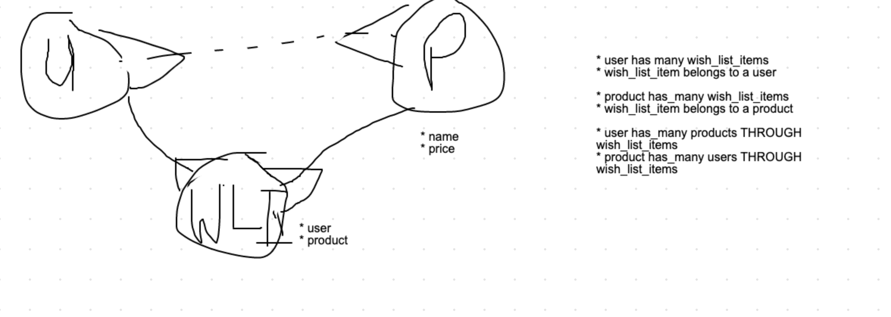

# OO Review

* the throughness of things
* do they want the whole instance of just an attribute of the instance

* user
* wish list item
* product 

* user -< wish_list_item >- product

## ERD

 

### User
* √`User.new` - initializes with a name(string) and email(string)
* √`user#name` - should return a string of the user's name, cannot be edited
* √`user#email` - will return a string of the user's email, can be edited
* √`User.all` - returns an array of all the user instances IN THE UNIVERSE
* `user#wishlist` - returns an array of products that the user has wish listed
* `user#remove_from_wishlist` - accepts a product as a parameter, returns a message formatted as such:
  "<product.name> has been removed from your wish list"

### Product
* √`Product.new` - initializes with a name(string) and price(float)
* √`product#name` - should return a string of the product's name, can be edited
* √`product#price` - should return a float of the product's price, can be edited
* `Product.all` - returns an array of all the product instances IN THE UNIVERSE
* `Product.most_wished_for` - returns an array of product instances that have been wish listed the most

### Wish List Item
* `WishListItem.new` - initializes with a user instance and a product instance
* `WishListItem.all` - returns an array of all the wish list item instances IN THE UNIVERSE
